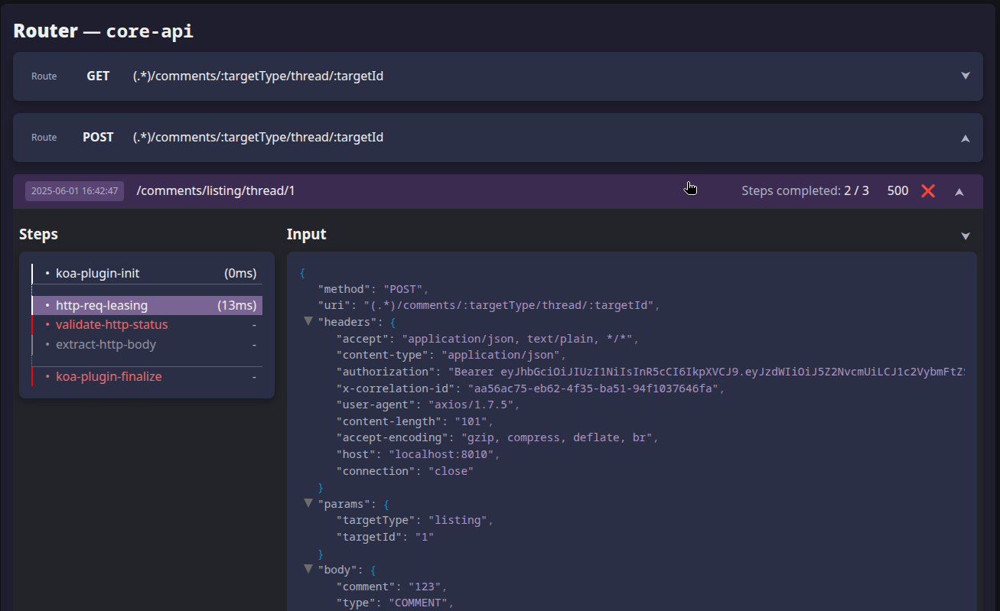
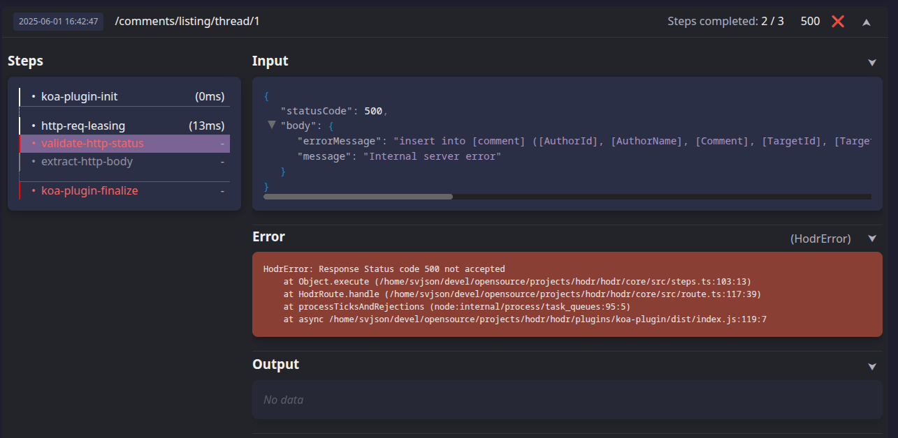

# Hodr

**DISCLAIMER: This is a draft, a proof of concept, a loose pile of ideas pretending 
to be a framework.**  

If you're looking for a mature product, you're in the wrong mythos.  
If you're looking for something that *might* save you from writing the same error-handling 
boilerplate for the 412th time this month - welcome. 

<br>

## What is Hodr?


Hodr is an experimental framework for composing and orchestrating microservice logic from 
small, testable, inspectable steps - and keeping the boring parts (like validation, 
error propagation, and response consistency) off your critical path.

It aims to reduce development time, improve consistency, and dramatically lower the number 
of things you have to do *every single time* you expose a new endpoint. Think of it as a 
toolkit for slicing your microservice into clean execution steps and letting Hodr 
handle the glue.

## Why should you care?

Because you're probably tired.

Tired of:
- Writing slightly different versions of `if (!payload.something) return 400` everywhere, 
and discovering that you and all reviewers of your code missed it this one time when it 
really mattered.
- Accidentally inventing new half-broken metadata formats for every microservice.
- Copy-pasting `try/catch` wrappers like it’s 2005 and you're just pushing the inevitable 
task of **making your webapp work in Internet Explorer 6** ahead of you.
- Logging failures in seven different inconsistent formats, of which two happen to be 
"not at all".
- And doing all of the above `n` times over again for the same one feature, as you 
implement your CRUDdy path through every service/layer in the stack and slowly close 
the distance between webapp and database table.

Hodr lets you define routes, attach validations, track step-by-step execution, and emit 
standardized responses - all while giving you full control and observability.

You get the benefits of structure, without the soul-sucking rigidity of a full-stack, 
monolithic framework.

## Design Goals

- **Focus primarily on intent, not low-level implementation details.** 
Hodr encourages you to describe what should happen, not obsess over how it happens in 
each handler. You define the path, Hodr manages the asphalt.

- **Declare, don’t reimplement.** Most microservice routes follow predictable patterns: 
validation, transformation, database calls, response shaping, passing the buck to the 
next service, etc. Hodr lets you declare these steps at the right level of abstraction 
instead of repeating them in different flavors across dozens of files.

- **Don't be clingy** - Hodr is modular by design. There should be no lock-in and 
applications should be free to use only the parts that suit your application.
Wrap a single route or your entire request pipeline - your choice. If you prefer to dive 
back into handcrafted imperative chaos at step 3, go right ahead. Hodr is a gentle deity 
and won't judge.

- **Bring your own stack**
Hodr doesn’t come with a pile of built-in dependencies. It’s designed to integrate with
your existing tools - whether you use Koa, Express, Axios, Knex, or a handwritten HTTP
parser carved into stone tablets.
You opt into what you need, and ignore what you don’t. Plugins are kept intentionally 
minimal - thin wrappers around focused libraries, doing one thing and doing it well.

- **Embrace consistency through composition** By turning route handling into declarative 
chains of composable steps, Hodr helps enforce uniform behavior: error handling, logging, 
metrics, input validation, and more - all without sprinkling `try/catch` or `console.log`
like it's confetti.

- **Traceability, not sorcery**
Hodr may raise the abstraction level, but it never hides what’s going on.
Every step is tracked, inspected, and recorded (if you so wish). You’ll know exactly what 
ran, in what order, with what input - no clandestine black-box behavior, no mysterious 
middleware stack to reverse-engineer at 3am.

### So what would all this look like in practice?

Good question. Let's have a look at some examples.

(The following sections contain a mix of current actual implementation and what's 
envisioned in the road map).

<br>

## DESIGN GOALS: "Focus primarily on intent, not low-level implementation details." & "Declare, don’t reimplement"

> *"Hodr encourages you to describe what should happen, not obsess over how it happens in 
> each handler. You define the path, Hodr manages the asphalt."*

> *"Most microservice routes follow predictable patterns: 
> validation, transformation, database calls, response shaping, passing the buck to the 
> next service, etc. Hodr lets you declare these steps at the right level of abstraction 
> instead of repeating them in different flavors across dozens of files."* - Konfucius

If we consider this code, lovingly pinched from [ONECore](https://github.com/Bostads-AB-Mimer) 
by Bostads AB Mimer.

This is the Koa route handler and the "adapter"-implementation in a backend-for-frontend service
that delegates the creation of a comment to the underlying orchestration service - simply 
called "core"..

**`comment-routes.ts`**
```ts
  router.post('(.*)/comments/:targetType/thread/:targetId', async (ctx) => {
    const metadata = generateRouteMetadata(ctx)
    const { targetType, targetId } = ctx.params

    const parseResult = AddCommentPayloadSchema.safeParse(ctx.request.body)
    if (!parseResult.success) {
      ctx.status = 400
      ctx.body = {
        error: `Invalid request body: ${JSON.stringify(ctx.request.body)}`,
        ...metadata,
      }
    }

    const result = await coreAdapter.addComment(
      { targetType, targetId: Number(targetId) },
      {
        ...parseResult.data,
        authorName: ctx.session?.account.name,
        authorId: ctx.session?.account.username,
      }
    )

    if (!result.ok) {
      ctx.status = result.statusCode
      ctx.body = { error: result.err, ...metadata }
      return
    }

    ctx.status = 200
    ctx.body = { content: result.data, ...metadata }
  })
```

**`comment-adapter.ts`**
```ts
  const addComment = async (
    threadId: CommentThreadId,
    comment: AddCommentRequest
  ): Promise<AdapterResult<Comment, 'unknown'>> => {
    try {
      const response = await getFromCore<{ content: Comment }>({
        method: 'post',
        url: `${coreBaseUrl}/comments/${threadId.targetType}/thread/${threadId.targetId}`,
        data: comment,
      })
      return { ok: true, data: response.data.content }
    } catch (e) {
      return { ok: false, err: 'unknown', statusCode: 500 }
    }
  }
```

From this implementation, we can describe this request path like so:

- Get the relevant request data
- Validate the payload against a schema
- Add the posting account information to the comment
- POST it to the underlying service and get the response
- Verify that request is successful (masking the error from downstreams, in this case)
- Pass on the response body to the caller.

Expressing the same execution path in Hodr could look like this:

**`hodr-comment-routes.ts`**
```ts
  router.post('/api/:targetType/:targetId/comments')
    .validate('body', AddCommentPayloadSchema)
    .extract({
      threadId: 'params',
      account: 'session.account',
      comment: 'body',
    })
    .transform('comment', ({ comment, account }) => ({
      authorId: account.id,
      authorName: account.name,
      ...comment,
    }))
    .httpPost('core-service', '/api/:targetType/thread/:targetId', {
      parameters: 'threadId',
      body: 'comment',
    })
    .select('body.content')
```
The key here is how the steps relate to eachother - that they will execute *in sequence*
with the output from each step being passed on as the input to the next.

As such, there's nothing radically new under the sun here. Most - if not all - of Hodr's
ideas echo tried and tested paradigms:

- **Promise chaining**, in how the result of one - potentially asynchronous - operation
passes its output to the next.

- **Functional programming**, in how behavior is composed from small, testable units that
are (mostly) free of side effects — except when we explicitly invoke destinations.

- **Lisp**, in the sense that everything is a step: composable, introspectable, and even
programmatically generated.

- **Integration Patterns (à la Apache Camel)**, where Hodr acts as a lightweight EIP
pipeline - inputs flow in, metadata is attached, decisions are made, side effects may
occur, execution may be halted, or an output emitted.

Let's break down what's going in the steps we just saw:

| Step               | Arguments                           | Description                                                                                                                                                                                                                                                 |
|--------------------|-------------------------------------|-------------------------------------------------------------------------------------------------------------------------------------------------------------------------------------------------------------------------------------------------------------|
| `router.post(...)` | *uri*                               | So far, this looks very much like any old express/Koa/whatnot route-definition, but `router` in this case is a **Hodr** construct, and the post(...)-function returns a `builder` object on which we build up the execution chain, or *lane*, step by step. |
| `validate()`       | *field*, *validator*                | Adds a validation step to the lane, in this case, using a **Zod** schema.                                                                                                                                                                                   |
| `extract()`        | *pattern*                           | A kind of transformation step where we name the fields of the current value(the incoming HTTPRequest) to collect into a new structure                                                                                                                       |
| `transform()`      | *field*, *function*                 | A transformation step that will store its result to the `comment` field of the current payload, and leave everything else intact. The actual transformation is a function taking the entire current payload as an argument.                                 |
| `httpGet()`        | *destination*, *target*, *manifest* | Send the current payload to a destination identified by `core-service`, using the `POST` http method, parameterizing the uri using                                                                                                                          |
| `select()`         | *path*                              | Logically equivalent to .extract('body.content').                                                                                                                                                                                                           |

A few things might stand out, glaringly so even:
- The error handling is suspiciously absent from this chain of steps.
- We are not formatting or advising how the response whould be shaped in any way!
- It looks practical and easy to read(if you buy into the idea), but what if this format doesn't cater to my requirements?

Let's address these three points over the next three sub-sections:

### Error handling

This is a cross-cutting concern and would be configured on router-level or Hodr-global, 
if at all. 

When it comes to status codes, the usual suspects here all fall under the category of 
**sane defaults**.

- The validation of the request body fails? That's clearly a `400 Bad Request`.
- `core-service` responds with an error? We'll pass that on.
- An unexpected error is raised? That's a `500 Internal Server Error` by its very definition.

When those same "sane defaults" do not apply for any reason, such as the route not having CRUD
semantics or actual insanity, we'll simply override and/or remap them.

```ts
_ // ...
  
  .httpGet('core-service', '/api/:targetType/thread/:targetId', {
    parameters: 'threadId'
  })
  .mapStatusCode([
    [404, 200], // The word on the streets is that 404 is the new 200!
    [[400, 417], 418], // Everything's a teapot! Except 404, which takes precedence because more specific.
    [[501, 511], 500] // The client doesn't need to know that we're out of storage or that a variant also negotiates(whatever that means).
  ])

  // ...

```

We can also, in true try-catch-and-do-nothing fashion, advise that certain error status codes
from `core-service` should _not_ be treated as actual errors/exceptions for cases where a 
`404 Not Found` is perfectly fine and expected.

This would look something like this:

```ts
_ // ...

  .httpGet('core-service', '/api/:targetType/thread/:targetId', {
    parameters: 'threadId'
  })
  .ensureStatus(200, 404)

  // ...
```

But it's not just about the status code - what about formatting the error according to
whatever standard your application follows? (If it doesn't follow one, well, here's your 
chance).

```ts
  const leasingRouter = hodr.router('core-leasing-api')
    .formatError(({ ctx, error }) => {
      const metadata = generateRouteMetadata(ctx.metadata.koaCtx)
      return { err: error.code, metadata }
    })
```

This example configures the response formatting for all routes that are defined, or that
will be defined, on this hodr-router.

### Response shaping

Also a cross-cutting concern. In most applications, responses follow a standard. In most cases, 
again that standard is simply dumping the payload in the response body, but for other formats - 
HATEOAS, for example, we'd do something like this:

```ts
  const leasingRouter = hodr.router('core-leasing-api')
    .finalizePayload(({ ctx, payload }) => {
      const metadata = generateRouteMetadata(ctx.metadata.koaCtx)
      return { content: payload, ...metadata }
    })
```

We CAN still of course bypass the router(or global) formatting, and apply additional transformations 
to specify what the response should look like in detail directly on a route, in the case that there's 
this one guy - just like in real life - that just won't acknowldge that he's in Rome.

```ts
_ // ...
   
  .httpPost('core-service', '/api/users/:userId/avatar', {
    parameters: 'threadId',
    body: 'comment',
  })
  .finalizePayload(( payload }) => {
    return arrayBufferToBase64(payload.imageData);
  })
```

Finalizing something means it's final. No one else can come and finalize your final thing. 
That's final! (*badum-tish*)

### "What if this doesn't cover all of my needs?"

Ah. Heaven and earth, Horatio, philosophy and all that jazz. Well, Hodr is no stranger to 
philosophy. Once he even philosomophized so hard that an egg materialized out of thin air 
and laid a hen at his feet. True story.

But, yes - that is likely to happen sooner or later. And when that happens...

- **A)** Consider that the above is the simplest case imaginable that does any real work
for the sake of example. For more advanced and endpoints that do actual processing, there 
would be the option to use parallell steps and performing functional map/reduce/filter on 
the combined results, or even case-conditionals and conditional steps as part of any lane 
or sub-lane.

- **B)** More importantly, brings us to the next topic...

<br>

## DESIGN GOALS: "Don't be clingy" & "Bring your own stack"

> *"Hodr is modular by design. There should be no lock-in and applications should be free 
> to use only the parts that suit your application. Wrap a single route or your entire 
> request pipeline - your choice. If you prefer to dive back into handcrafted imperative 
> chaos at step 3, go right ahead. Hodr is a gentle deity and won't judge.*"

### Integrating with other libraries

Hodr isn't here to steal your stack. Quite the opposite - it’s designed to sit quietly atop 
whatever framework or architecture you’re already using, and enhance it where helpful. 
Whether you’re dealing with Koa, Express, Axios, Knex, your own REST client, or a mutated 
fetch wrapper from 2017 - Hodr is built to fit in, not take over.

The abstractions for **Origins and Inputs**(e.g., routers and routes) and
**Destinations and Targets**(e.g., HTTP clients and remote APIs) in Hodr are intentionally 
generic. The core package (`@hodr/core`) ships with zero assumptions. There are no
default integrations - just flexible interfaces waiting to be bound to your app’s existing 
infrastructure.

While `@hodr/core` doesn't provide any out-of-the-box implementation, there are however... 
other boxes. Currently, those would be [koa-plugin](plugins/koa-plugin) and 
[axios-plugin](plugins/axios-plugin), who provide that thin layer of glue required.


### Integrating with existing routing libraries

If you're using Koa, Express, Fastify, or any other HTTP framework, you stay in charge of 
wiring them up. Hodr doesn't offer a replacement router - it offers a router-shaped 
abstraction that installs its runtime routes in your HTTP framework configuration.

```ts
  import { mount } from '@hodr/koa-plugin'

  // -----> Your regular setup
  
  const app = new Koa()
  const router = new KoaRouter()
  
  app.use(cors())
  app.use(bodyParser())

  // -----> Enter stage: Hodr

  // Configure and add a Hodr router.
  const myHodrRouter = hodr.router('core-leasing-api')
  
  // Let an application module define the actual routes
  leasingRoutes(myHodrRouter) 
  
  // Apply the routes to the KoaRouter.
  mount(koaRouter, myHodrRouter) 
```

This lets you manage middleware, body parsing, headers, sessions, and error handling your way. 
Hodr handles what happens within the lane, not around it.

In a greenfield project, you’re still encouraged to configure and use Koa or Express 
directly - define your CORS behavior, your middleware stack, your static file serving. 
Hodr isn't going to wrap that up in a leaky abstraction and call it simplicity™. 

You do your app setup; Hodr handles the pipelines.


### Integrating existing code into Hodr Lanes

Not only could a random piece of code be a **Destination**, there is usually no need to 
even go that far - a simple *transformation* or *apply* step could delegate to... anything,
really.

Let's revisit the example from the previous section, and see how we could keep the 
`comment-adapter.ts` as is and simply jack into that same `addComment` function. In this 
particular case, it doesn't buy us anything and also forces us to deal with inspecting and 
reacting to the return type in a non-premium way. But we could!

```ts
  router.post('/api/:targetType/:targetId/comments')
    .validate('body', AddCommentPayloadSchema)
    .extract({
      threadId: 'params',
      account: 'session.account',
      comment: 'body',
    })
    .transform('comment', ({ comment, account }) => ({
      authorId: account.id,
      authorName: account.name,
      ...comment,
    }))
    .apply(async ({ comment, account }) => await addComment)
    
    // ...and so on
  )
```

There would be other cases where this makes more sense, however. Some things are
undoubtedly best expressed as actual imperative code and shouldn't be squeezed into this
declarative idiom as a one size fits all solution. "One size fits all" has never properly
applied to anything, anywhere or at any time in the history of the world. And the world has
been around for a long time.

In these case we would be better of treating them as, from their own perspective, plain old
functions - and from a Hodr perspective, fully custom steps.

### Imperative escape hatches are not a failure - they're a feature

Again - some logic is best written in plain functions, with loops and conditionals and flags and 
early returns. Hodr lets you wire that into a lane with minimal ceremony. That doesn’t mean
giving up observability or error handling - it just means you stay in control.

By treating imperative logic as just another step in the lane, Hodr avoids the trap of 
*"everything must be declarative or abstract"*. You get clarity and flexibility - not one 
at the cost of the other.

### Using Hodr lanes inside existing logic

Not everything has to start at a route or Origin definition. Sometimes you’re in the middle 
of an app service and want to run a reusable lane of processing logic - for enrichment, 
transformation, validation, or side effects.

You can do that, too:

```ts
const result = await userProfilePipeline.run({ user, metadata });
```

The pipeline doesn’t care who called it - just that it received the inputs it was promised.

Without a route Origin pulling the strings, there is no assumption of starting off from an
HTTP Request and ending up with an HTTP Response.

<br>

## DESIGN GOAL: **Embrace consistency through composition**

> By turning route handling into declarative chains of composable steps, Hodr helps enforce
> uniform behavior: error handling, logging, metrics, input validation, and more - all without 
> sprinkling `try/catch` or `console.log` like it's confetti.

So, now that we’ve shaped the world into a declarative and pipe-shaped paradise, will life 
be beautiful all the time? No. Of course not.

When several lanes interact with the same destinations or work with similar data flows, 
it makes no sense to reimplement the same unwrap/validate/postprocess logic again and again. 
The *DRY principle still applies* - only now we get to express it in terms of reusable 
pipelines.

Just like you'd separate your routes from service logic, or your database adapters from 
business rules - even if you're not smoking fat cigars in dining car on board the 
onion-layering express - it still makes sense to attach reusable sub-lanes or processing 
steps to common points of interest:

- Unwrapping, transforming and validating results
- Building models and data structures from distributed state
- Inserting or mapping data for downstream services
- Attaching logging, metrics, or observability to operations

Ideally, only the parts that are very specific to a certain **Origin** should be expressed
immediately on its own lane. The rest should refer to and delegate to re-usable parts.

```ts
  leasingService.target('update-listing-status')
    .httpPut('/listings/:listingId/status')
    .mapStatusCode([
      [404, (step) => {
        step.error({statusCode: 404, code: 'not-found', message: 'Listing does not exist.' })
        step.log('error', 'This really should not happen. Like really, really not.')
      ],
      [409, { statusCode: 409, code: 'conflict', message: 'Listing status may not be updated further.' },
      [500, { statusCode: 500, code: 'generic', message: 'The server is broken, on fire or just refusing to cooperate.' },
    ])
    .ensureStatus(200, 204)
    .extract('content')
    .log('info', 'Listing {listingId} updated to status "{status}"')
```

This example shows how to attach a re-usable lane onto a service endpoint/HttpClient target
so that it executes consistently every single time.

These building blocks don’t have to be "special" Hodr modules — just cleanly defined 
pieces of logic that can be reused declaratively.

We’ve already seen this in action with error handling and response status checking. But 
that’s just the tip. Build your own composition helpers, centralize your common steps, 
and wire them into lanes as needed — no boilerplate, no regrets. 
Well, some regrets probably - after all, they are more constant than the Gods.

<br>

## DESIGN GOAL: "Traceability, not sorcery"

> *"Hodr may raise the abstraction level, but it never hides what’s going on.
> Every step is tracked, inspected, and recorded (if you so wish). You’ll know exactly what 
> ran, in what order, with what input - no clandestine black-box behavior, no mysterious 
> middleware stack to reverse-engineer at 3am."*

Application logs are a must for any system that meets the real world. But flat line-based
logs are not the only way.

We've saved one of the **best parts** for last - since Hodr executes the steps of a lane in
a controlled way and explicitly deals with passing along inputs, outputs and state down the
line and purposefully catches and inspects any kind of exception along the way, we now as a
side-effect have the option to store this information.

This means that we can follow a request from start to finish and inspect the inputs, outputs
and whatever metadata that got attached at every turn.

Each step in the chain is tracked at runtime. This means:
- You can see *what ran*, *in what order*, *with what inputs*, and *what it produced*.
- Your recorded execution history can tell a real story, not just 
`“error: something went wrong. Again.”`

This helps during development, testing, and - crucially - production, where debugging without 
breadcrumbs is just... wild animal tracking.

## Hodr Inspector

If we store this all this execution metadata, all we need is a practical way to read it. 
Why not from a web interface optionally attached to the application itself?



The Hodr Inspector gives you an at-a-glance view of what happened, when, and why. Every step 
is tracked. Every transformation, every outbound call, every failure - clearly visible and 
timestamped.

- Which step failed?

- What was the payload at that point?

- What did the destination service respond with? (apart from the 500 one-liner with zero 
context that ended up in the application log).

- Did your input validation bail early?

### As a development tool

All of these questions basically answer themselves. You no longer have to go spelunking 
through log files or scatter debug prints all over your app. The Inspector turns your 
execution trace into something navigable, helping you track down bugs, weird input, or 
just understand what your code actually did.

The amount of time that could be saved during development is hard to estimate, but I suspect
that it could be measured in the unit of "buckets". Especially for tracking down Heisenbugs 
and similar behavior that you observed once and never again, and then convinced yourself 
must have been your imagination.

Not just for development: this can be a production feature. Attach it to audit logs or 
failure dashboards, and you’ve got immediate visibility into unexpected behavior - 
no guesswork required.

At the moment, the stock implementation of the data collection is just a poor old in-memory 
array of execution contexts. It’s simple, effective, and works well during local development. 
But it’s only the beginning.

### As a diagnostics tool for production environments

Imagine plugging in a persistent backend - like MongoDB or PostgreSQL - and storing every 
execution trace there.

Then take it one step further: add a correlationId to incoming requests and propagate it 
throughout your system, and let the Inspector aggregate on that.

Suddenly, the Inspector becomes more than a development tool - it becomes a distributed 
request tracer. You’re no longer limited to understanding what happened inside a single 
microservice. You can follow the full journey of a request:

- From the edge service that received it
- Through the internal logic and conditionals of that service
- Across HTTP calls to other services
- Into those services’ own pipelines and processing chains

All joined together by a shared correlationId, rendered as a unified, navigable graph of 
steps and events.



You’ll see:

- What was called, and when
- Who responded with what
- Where data was transformed or dropped
- And crucially, where and why it took a bullet and went belly up.

### And more?

This isn’t just for debugging and diagnostics. 
It’s potentially a priceless tool in your belt for:

- Auditing
- Regression tracking
- Failure reporting on integrationn/end-to-end tests.
- Performance bottleneck analysis
- Business logic validation

It’s the missing visibility layer in modern microservice architecture - and Hodr gives it 
to you, not as a bolt-on observability suite, but as a natural side effect of how your app
is structured.

Well, at least that's the promise before you start considering the compliance and legal 
aspects of gathering all this data and business details in a big pile like this. I said it
before you did, but it's still you that's no fun at parties.

<br>

## So, Should You Use It?

Not quite yet. Probably not in your project. Absolutey not in production.

But if you're:
- Building out a new service and want a smarter foundation,
- Prototyping microservices and sick of wiring everything by hand,
- Exploring how to design better runtime inspection of request handling,

... then it's worth a look. Just don’t blame us if it breaks. It's still mostly an idea -
a pipe dream, if you will.

## Roadmap (ish)

Box of random ideas and plans, basically. But roadmap sounds good. That implies 
there's a road and a map - both usually tremendously helpful for getting anywhere.

- [ ] Stabilize route + step API
- [ ] Pluggable validation (Zod, yup, Ajv, or roll-your-own)
- [ ] Test All The Things!
- [ ] Adapter/result standardization
- [ ] Plug-and-play error handling
- [ ] Aggregate execution recording across services
- [ ] Dev tools for visualizing execution chains
- [ ] Metrics/reporting integrations


## Credits

Built and typed up with a mix of frustration, optimism, near-lethal amounts of Coke Zero, 
fervent prayers to the Omnissiah and a dash of Norse mythology.

## License

MIT License. See [`LICENSE`](LICENSE) for details.

---

© 2025 Sven Johansson. MIT Licensed.
